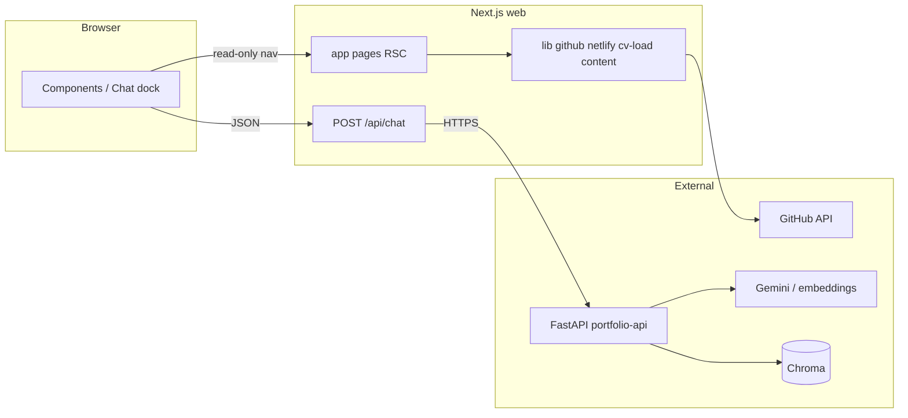

# Portfolio App (NBW) — AI development context

_Dokumentacija ovog fajla usklađena je sa kontekstom **maja 2026.**; posle većih promena stacka ili domena vredi ga kratko osvežiti._

## Savetovanje i noviteti (rez treninga modela)

Kad korisnik traži **najnovije** stvari u ekosistemu (verzije, alati, „šta je danas obavezno“):

- Odgovori modela mogu biti zasnovani na **rez-u treninga**, ne na događajima, izdanjima ili blogovima posle tog trenutka — to **nije isto** kao „stanje na webu danas“.
- **Agenti** u takvim razgovorima treba da **eksplicitno podsete** na to ograničenje i da predlože **proveru izvora**: zvanična dokumentacija, release notes, repozitorijum (npr. `package.json`, `DEPLOY.md`, lock fajlovi), **web pretraga** ili MCP alati gde su dostupni — umesto tvrdnji o apsolutnoj ažurnosti bez citata.
- Za ovaj monorepo, **praktičan izvor istine za šta stvarno koristimo** su fajlovi u repou i `CLAUDE.md`, a ne samo pamćenje modela.

## Konkretan use case (bez „šta ako“)

**Ko:** jedan developer — **prezentacioni sajt** (nema naplate, nema korpe, nema pretplate, nema korisničkih naloga kao proizvoda). Cilj je učenje + profesionalna prezentacija rada, ne pokretanje servisa na tržištu.

**Šta sajt radi danas:**

1. Predstavlja tebe — početna, tekst iz `content/`, mobilan raspored.
2. Prikazuje rad — lista repozitorijuma sa GitHub-a (+ ručno ubačeni projekti), linkovi ka živim demoima gde postoje.
3. Izvozi CV — čitljiv i štampljiv `/cv`, sadržaj u `content/cv.json` (bez kopanja po TypeScriptu za svaku izmenu).
4. Daje kontekstualnog asistenta — korisnik pita na sajtu; odgovor ide preko RAG-a (tvoj markdown + README), ne „nagađanje iz praznog LLM-a“.

**Uspeh:** posetilac za minut shvati ko si i šta gradiš; recruiter ili mentorka otvori projekte i CV; ti lokalno i na besplatnim / jeftinim tierima hostuješ isti kod sa zdravim deployom (health checkovi, env odvojen od repoa, proksi umesto izlaganja API ključa u browser).

To je **ceo** proizvodni opis — agenti ne treba da projektuju nove „platforme“ van ovog opsega osim ako ti eksplicitno ne tražiš.

## Best practice u domenu prezentacionog / portfolio sajta

Ovo su **smernice u industriji** za sajtove koji predstavljaju jednog autora (ne zakoni i ne „jedini pravi“ izgled). Tehnički sloj treba da ih poštuje; **vizuelni i funkcionalni identitet ostaje tvoja odluka** (vidi ispod).

**Tehnički i UX (često očekivano):**

- **Performanse:** brz prvi prikaz (LCP, manje render-blokinga), smisleno učitavanje fontova (`next/font`), optimizacija slika gde ima smisla; povremeno proveri Lighthouse / Core Web Vitals na produkciji.
- **Pristupačnost (a11y):** semantički HTML, kontrast i čitljivost, fokus za tastaturu, smisleni `aria-*` na interaktivnim delovima (npr. meni, dijalog chata).
- **Responsive:** mobile-first raspored; test na malim širinama (npr. ~375px) pre „desktop polish“.
- **Sadržaj:** jasna početna (ko si / šta radiš), projekti sa linkom ka izvoru i ka živom demo-u kad postoji, kontakt ili jasan sledeći korak, CV ili rezime kad je relevantno recruiterima.
- **Privatnost:** bez analitike koja krši očekivanja bez transparentnosti; bez nepotrebnog trekinga (ovaj projekat ne gradi monetizaciju preko podataka posetilaca).
- **SEO / deljivost:** smisleni `title` i opisi po stranici (`generateMetadata` gde treba), čisti URL-ovi.

**Šta agenti ne treba da rade:** da „unifikuju“ sajt u generički portfolio šablon iz treninga (isti hero, iste sekcije, ista paleta kao na hiljadu tema) **bez tvog eksplicitnog zahteva**. Predlozi se uvek uklope u postojeći vizuelni jezik repoa (`CLAUDE.md` → Visual notes) ili u smer koji tvoj korisnik definiše u promptu.

## Dizajn i funkcionalnost — vlasnik odlučuje (jedinstvenost)

- **Ti** biraš izgled, ton, i koje funkcije imaju smisla (npr. Lab scena, oblik chata, hijerarhija navigacije).
- **Agenti** implementiraju, refaktorišu i čuvaju stabilnost; ne zamenjuju autorski izbor „standardnim“ izgledom ako to nije traženo.
- Best practice iz sekcije iznad = **kvalitet i održivost** (perf, a11y, sigurnost), ne **uniformnost** sa tuđim sajtovima.

## Principi (best practice, stabilnost, rast — bez pretiranja u servis)

| Princip | Šta znači u praksi |
|--------|---------------------|
| **Best practice** | Uobičajeni obrazac (stanje polovinom 2026.): App Router, server env za tajne, zodirani env, poseban API za teške/AI stvari, Docker za reproducibilnost, zaseban vektor store od aplikacionog koda. |
| **Stabilnost** | Pinovane verzije gde je to spašavanje od poznatih produkcionih bagova (npr. Next major); health / ready rute; smislen CORS; perzistentan Chroma na hostu. |
| **Sigurnost** | Nema ključeva u repou; `NEXT_PUBLIC_*` samo za stvarno javno; chat ide preko BFF (`/api/chat`), ne direktno sa ključem u klijentu. |
| **Modularnost** | `web/` | `api/` | `content/` su jasno odvojeni; promena sadržaja ne zahteva redeploy API-ja svaki put ako ne diraš ingest model. |
| **Mogućnost razvoja** | Monorepo ostaje; možeš zameniti Chroma → Qdrant, proširiti RAG, dodati testove — bez menjanja cele priče arhitekture. |
| **Trošak** | Cilj je **free / niski tier** (Vercel + Railway free krediti, Gemini free tier gde je dovoljno), uz iste obrazce kao na plaćenim projektima — ne gomilanje enterprise alata „za svaki slučaj“. |

## Project overview (tehnički)

Personal portfolio **monorepo**: marketing site (Next.js), GitHub-backed **Projects**, editable **CV**, optional Netlify enrichment for deploy URLs, and an on-site **RAG assistant** (browser → Next `/api/chat` → FastAPI `/chat` → Gemini + Chroma).

**Do not treat this like a single Next app:** `web/` and `api/` deploy separately (Vercel + Docker host).

## Tech stack (strict — do not “upgrade” casually)

Izbori ispod nisu „najnovije zato što je hype“: to je **široko usvojen, modern** set koji dobro odgovara use case-u iznad i tipičnom developerskom portfoliju. Upgrade radi samo posle provere (`DEPLOY.md`, build, brejking čejndževi).

| Area | Choice | Notes |
|------|--------|--------|
| Frontend | **Next.js 15.x** App Router, React 19 | **Pinned ~15.5.x** on purpose. Next 16.2.x + Vercel Git deploy had `routes-manifest-deterministic.json` issues; see `DEPLOY.md` before bumping major. |
| Frontend styling | **Tailwind CSS v4** | `@import "tailwindcss"`, `globals.css`. |
| Frontend validation / env | **Zod** | `clientEnv` / `serverEnv` in `web/src/lib/env/`. |
| Backend | **FastAPI** + **LlamaIndex** + **Chroma** | `api/portfolio_api/`. |
| LLM / embeddings | **Google GenAI** (Gemini) | `GOOGLE_API_KEY` or `GEMINI_API_KEY`. |
| Content | **`content/*.md`** + **`content/cv.json`** | `web/scripts/sync-content.mjs` copies into `web/_content/` at build. |
| Vector store (local) | Chroma under `data/chroma/` | Gitignored. |
| Hosting | **Vercel** (`web/` root) + **Railway** (or similar) for API | See `DEPLOY.md`. |

## Repository layout (actual)

```
Portfolio App/
├── web/                      # Next.js — Vercel Root Directory = web
│   ├── src/app/              # App Router pages + api/chat proxy
│   ├── src/components/       # Site header, chat dock, CV, lab scenes
│   ├── src/lib/              # github, env, cv-load, RAG proxy consumers
│   ├── scripts/sync-content.mjs   # content/*.md + content/cv.json → _content/
│   └── AGENTS.md             # Stub; root CLAUDE.md + AGENTS.md are canonical
├── api/
│   ├── portfolio_api/        # main.py, rag.py, ingest.py, settings.py
│   └── Dockerfile            # built from monorepo root context
├── content/                  # about.md, skills.md, cv.json, …
├── .env.example              # template (never commit real .env)
├── DEPLOY.md                 # Vercel + Railway checklist
├── README.md                 # local setup, ingest, dev servers
├── LLAMAINDEX_GUIDE.md       # AI/RAG notes for this repo
└── .cursor/rules/llamaindex.mdc  # Cursor rule for LlamaIndex/RAG work
```

## Zavisnosti i tok — kako kod „klizi“ (jedan model, dobra ekipa)

Cilj je da **svako zna ko poziva koga**, bez skrivenih „prevodilaca“ u glavi. Granice ispoštovane = manje bagova, lakši refaktor.

### Slojevi (odozgo nadole)

| Sloj | Gde | Uloga | Ne radi |
|------|-----|-------|--------|
| **UI** | `web/src/components/*` (client gde treba), `web/src/app/*/page.tsx` | Prikaz, forma, događaji | Ne zove GitHub API direktno iz browsera; ne čita tajne |
| **Rute (App Router)** | `web/src/app/**` | Server Components: sastavlja stranicu, `await` na server lib | Ne uvodi duplu logiku env-a van `env/` |
| **Server lib** | `web/src/lib/*` (`server-only` gde je označeno) | GitHub, Netlify, čitanje fajlova, PDF nema — `getCvData`, `readMarkdownFile`, proksi smernice | Ne importuje stvari koje bi razotkrile token u klijent |
| **BFF** | `web/src/app/api/chat/route.ts` | Jedini server endpoint za chat ka spoljašnjem API-ju; koristi `serverEnv().PORTFOLIO_API_URL` | Nema biznis RAG logike — samo HTTP proksi |
| **Python API** | `api/portfolio_api/*` | RAG, ingest, rate limit, CORS | Ne zna za Vercel; zna za `CORS_ORIGINS`, `GOOGLE_API_KEY`, Chroma |
| **Content** | `content/*` → `web/_content/` (build) | Izvor istine za tekst/CV JSON | Ne meša se sa TypeScript tipovima osim kroz schema u `cv-schema.ts` |

### Podela env-a (da nema „dve istine“)

- **`clientEnv`** (`web/src/lib/env/client.ts`) — samo `NEXT_PUBLIC_*` koje smeju u bundle (ime, javni GitHub URL).
- **`serverEnv`** (`web/src/lib/env/server.ts`) — sve ostalo za Next server: `GITHUB_*`, `PORTFOLIO_API_URL`, `NETLIFY_*`, `CV_HEADLINE_APPLYING_FOR`, `NEXT_PUBLIC_GITHUB_URL` (i na serveru za inferenciju login-a). Učitava koren monorepa + `web/` preko `loadEnvConfig`.
- **Python** (`api/portfolio_api/settings.py`) — API ključevi, Chroma, CORS, GitHub za ingest; **ne mešati** sa Next env imenima u istom fajlu u `web/`.

### Tri glavna toka (fajl → fajl)

1. **Početna (about/skills)**  
   `page.tsx` → `readMarkdownFile` → `content/*.md` ili `web/_content/*.md`.

2. **Projects**  
   `projects/page.tsx` → `fetchUserRepos` / `hasGithubListingIdentity` (`github.ts`, koristi `serverEnv`) → GitHub API; paralelno `fetchNetlifyDeployIndex`, opciono `fetchReadmeLiveUrlLookup`; kartice koriste `project-groups`, `repo-live-url`.

3. **Chat**  
   `chat-dock.tsx` (client) `fetch("/api/chat")` → `api/chat/route.ts` → `fetch(PORTFOLIO_API_URL + "/chat")` → `main.py` → `rag.py` / Chroma / Gemini.

4. **CV**  
   `cv/page.tsx` → `getCvData` (`cv-load.ts`) → `content/cv.json` ili `_content/cv.json` + opcioni override `serverEnv().CV_HEADLINE_APPLYING_FOR`.

### Šema toka (chat + sadržaj)



### Pravilo za novi kod

Pre nego što dodaš modul: **(1)** koji sloj?, **(2)** koji env?, **(3)** da li već postoji `lib/*` koji to radi? — Izbegava se treći „prevodilac“ u vidu duplog fetch-a ili duplog parsiranja env-a.

### Čisti start (da sve „proradi“ isto)

**Fallback jednom komandom (Windows):** `npm run workflow:minimal` (blago). **`npm run dev:full`** / **`workflow:reset`** = `clean:web` + doktor `--fix` + API + Next + **doktor u pozadini** (`doc`, nakon `POST_DEV_DOCTOR_DELAY_MS`) da proveri health kad su servisi gore. Detalji u **[`README.md`](README.md)**. Lokalni API u root skriptama: port **8020** — **`PORTFOLIO_API_URL`** u `.env` mora da se slaže.

## Current state (maintain this section when scope changes)

### Done (baseline)

- Next.js site: home (markdown sections), projects (GitHub + manual projects, groups, Netlify/README fallbacks), CV (from `content/cv.json` + optional `CV_HEADLINE_APPLYING_FOR`), contact, lab (Aang ritual / Lottie).
- Server env loads monorepo root `.env` and `web/.env` so `GITHUB_USERNAME` and friends work when dev runs from `web/`.
- GitHub listing: **strict on Vercel** (must configure identity); **relaxed off Vercel** (empty list + `console.warn`, no hard fail) — see `web/src/lib/github.ts`.
- Chat: Vercel route handler proxies to `PORTFOLIO_API_URL` + `/chat`; SSE streaming. **Preview + Production** must both have `PORTFOLIO_API_URL` if you test preview URLs.
- API: `/health`, `/health/ready`, `POST /chat`, ingest in Docker entrypoint; CORS must include production site origin.
- Mobile: responsive header with drawer nav; chat dock uses safe-area insets.
- Tooling: ESLint flat config ignoriše `.next/` i generisani `_content/`; `projects/page.tsx` normalizovan format (bez „duplog“ preloma linija).
- Dijagnostika: **`npm run doctor`** (`scripts/portfolio-doctor.mjs`) — env, sadržaj, sync, `/health` + `/health/ready`, GitHub; **`--fix`**, **`--strict`**. Start: **`workflow:minimal`** (blago) ili **`dev:full`** / **`workflow:reset`** (čist build + dev + pozadinski doktor); **`dev:with-doctor`** — doktor pre `dev` bez čišćenja.

### Known constraints / pitfalls

- **Vercel:** Project **Root Directory = `web`**. Enable including files outside root for build if `content/` must be copied from parent.
- **Railway public port:** App listens on `$PORT` (often **8080**), not necessarily 8000 — Networking target must match logs.
- **GitHub env on Vercel:** Set `GITHUB_*` and/or `NEXT_PUBLIC_GITHUB_URL` for production; for Preview deployments, attach the same vars to **Preview** environment.
- **Lint:** `web/eslint.config.mjs` ignoriše `.next/`, `node_modules/`, `_content/`; koristi `npm run lint` i `npm run typecheck` u `web/`.

### What’s NEXT (edit as you go)

1. Keep `CLAUDE.md` / this section updated when architecture or deploy steps change.
2. Optional: tighten E2E or smoke tests for `/api/chat` + Railway `/health`.
3. Optional: Qdrant path documented in README if you migrate off Chroma.

## Architecture rules

### Web (`web/`)

1. **Server Components by default.** Add `"use client"` only for hooks, browser APIs, or interactive UI (e.g. chat dock, header menu).
2. **Secrets and server-only data** — use `server-only` modules and `serverEnv()`; never expose tokens via `NEXT_PUBLIC_*`.
3. **Proxy pattern:** Browser calls **`POST /api/chat`** only; it forwards to **`PORTFOLIO_API_URL`** (no direct browser → Railway for chat).
4. **Content:** Edit `content/*.md` and `content/cv.json`. For a quick CV headline override only, use **`CV_HEADLINE_APPLYING_FOR`** in `.env` (see `.env.example`).
5. **ISR:** Projects page uses `revalidate` — keep GitHub/Netlify behavior consistent with documented cache.
6. **Mobile-first:** new UI follows existing Tailwind patterns; avoid horizontal nav overflow on small widths.

### API (`api/`)

7. **Settings** via Pydantic / env; **CORS** must list real site origins in production.
8. **RAG / LlamaIndex:** When changing retrieval, agents, or tools, read **`.cursor/rules/llamaindex.mdc`** and `LLAMAINDEX_GUIDE.md`.
9. **Health:** `/health` liveness vs `/health/ready` readiness (keys + index) — keep them meaningful for Railway.

### Security

10. **Never commit** `.env`, API keys, or tokens. Use `.env.example` only for names and hints.
11. **Admin endpoints** (e.g. RAG invalidate) must stay protected if exposed publicly.

### Git hygiene (recommended)

12. Avoid destructive commands on uncommitted work (`git reset --hard`, `git clean -fd`, careless `stash drop`). Prefer WIP commits or a separate worktree when experimenting.
13. Prefer **small, focused commits** with clear messages.

## Environment variables (cheat sheet)

**Shared / Next (root `.env`, loaded into Next):**  
`NEXT_PUBLIC_DISPLAY_NAME`, `NEXT_PUBLIC_GITHUB_URL`, `GITHUB_USERNAME`, `GITHUB_TOKEN`, `PORTFOLIO_API_URL`, optional Netlify tokens, optional `README_LIVE_URL_*`, optional `CV_HEADLINE_APPLYING_FOR`.

**API:** `GOOGLE_API_KEY` or `GEMINI_API_KEY`, `GITHUB_*` for ingest, `CORS_ORIGINS`, `PORT`, `CHROMA_PATH` (container persistence).

Full tables: **`DEPLOY.md`** and **`.env.example`**.

## Key docs (source of truth)

| Doc | Purpose |
|-----|---------|
| `README.md` | Local setup, ingest, run web + API |
| `DEPLOY.md` | Vercel + Railway, env, ports, volumes |
| `.env.example` | Variable names and hints |
| `LLAMAINDEX_GUIDE.md` | RAG / LlamaIndex behavior in this repo |
| `content/cv.json` | CV content (editable) |

## Visual / UX notes

- Dark UI baseline: background **`#0b0f14`**, accent **cyan / violet** gradients (see existing pages).
- typography: Geist via `layout.tsx`.

## Agent checklists

**Before changing the stack version** (Next major, LlamaIndex major): read `DEPLOY.md` + run `web` build locally; confirm Vercel project root and Node version.

**Before changing chat or RAG:** read `LLAMAINDEX_GUIDE.md` and `api/portfolio_api/main.py` streaming paths.

**Before deploy:** `PORTFOLIO_API_URL` on Vercel (Production **and** Preview if needed), Railway **`$PORT`** matches public networking, `CORS_ORIGINS` includes Vercel origin.

**Lokalna dijagnostika:** run **`npm run doctor`** from the repo root (see `README.md`); it surfaces env/content/API issues and prints fix steps. Use **`npm run doctor -- --fix`** to sync `content/` into `web/_content/` automatically.
